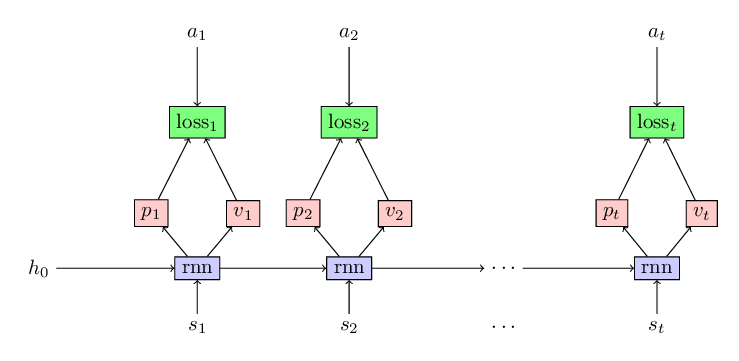

# Recap
This is the second blog in the series of applying RNN in Policy Gradient methods. In the first
[blog](https://abhishm.github.io/blog/), we  learned about:
1. Markovian assumption of reinforcement learning problem.
2. the use of Recurrent Neural Network (RNN) policy in non-Markovian setting.
3. the different factors we need to consider before feeding a trajectory to an RNN policy.
4. The basic code to incorporate an RNN policy in policy gradient methods.

In this blog post, we will learn about baseline strategy that is used for reducing the variance in the policy gradient methods and how can we incorporate it in an RNN policy.

# Baseline

As we know from the previous discourse that in a reinforcement learning problem, our goal is to maximize the total expected reward obtained in a trajectory. Assume that we are following a policy $\pi_\theta$.

Using this policy, we interact with the environment and we obtain a trajectory $\left\{(s_0, a_0, r_0), (s_1, a_1, r_1), \ldots (s_{T-1}, a_{T-1}, r_{T-1}), s_T\right\}$.  Our goal is to maximize the reward $G(\theta)$ defined as following:
$$
G(\theta) = E\left[\sum_{t=0}^{T-1} r_t\right]
$$
[Policy gradient theorem](https://web.eecs.umich.edu/~baveja/Papers/PolicyGradientNIPS99.pdf) tells that

$$
\Delta_\theta G(\theta) \propto E\left[\sum_{t=0}^{T-1} \nabla_\theta \log \pi_\theta(a_t|s_t) R_t\right]
$$
where $R_t = \sum_{t'=t}^{T-1}\gamma^{t'-t}r_{t'}$. The rule for updating the policy parameters $\theta$ is easy. We can use the Monte-Carlo estimate to compute the gradient and can use the estimated gradient
to update the policy parameters $\theta$. This is essentially the Vanilla Policy Gradient algorithm. However, we are estimating the gradient which could have high variance. Baseline is the strategy introduced to reduce
this variance in the gradient estimate.

# A quick introduction to Monte-Carlo Estimate
Whenever you see an expression like this $E[X]$, you can think of that it is time to use Monte-Carlo estimate. Monte-Carlo estimate are inspired by law of large numbers that essentially says the following:
$$
\lim_{n \rightarrow \infty }\frac{X_1 + X_2 + \ldots + X_n}{n} \rightarrow E[X]
$$  
Where $X_1, X_2, \ldots, X_n$ are independent and identically distributed random variable as random variable X. In short, to estimate $E[X]$, generate lot of samples according to distribution of random variable $X$ and the mean of these samples will be close to $E[X]$. This raises a couple of questions $-$ How many samples? How close to true value?  

If we use $n$ samples, our estimate for $E[X]$ is $\mu_n = \frac{X_1 + X_2 + \ldots + X_n}{n}$. $\mu_n$ is a random variable with mean $E[X]$ and variance $\frac{\sigma^2}{n}$ where $\sigma^2$ is the variance of random variable $X$. This imply that $\mu_n$ is an unbiased estimate of $E[X]$. However, the RMSE in the estimate of $E[X]$ by $\mu_n$ only reduces as $O(n^{-1/2})$. This is a bad news. If we want to improve our estimate by three decimal points, we need 1 million more data points. So a question comes, how can we reduce the variance in the Monte-Carlo estimate.

# Reducing the variance in Monte-Carlo estimate
Note that the variance in Monte-Carlo estimate of $E[X]$ is $\frac{\sigma_X^2}{n}$ where is $n$ is the number of samples and $\sigma_X^2$ is the variance of the $X$. There are two ways to reduce the estimate--1) by increasing $n$ or 2)by reducing $\sigma_X$. You may be thinking that $\sigma_X$ is a constant. How can we reduce it? You are correct. What I wanted to say is a little bit more here. Lets get a new random variable $Y$ such that $E[Y] = E[X]$ and $\sigma_Y < \sigma_X$. Then we will compute the Monte-Carlo estimate of $E[Y]$. By doing this, we compute the Monte-Carlo estimate of $E[X]$. However, we will have less variance because $\sigma_Y < \sigma_X$. Precisely, we will apply this trick to reduce the variance in policy gradient algorithm.

# Reducing the variance in the policy gradient estimate
We know that in the policy gradient estimate, we need to compute an estimate of $E\left[\sum_{t=0}^{T-1}  \nabla_\theta\log \pi_\theta(a_t|s_t) R_t\right]$ to update our policy. Lets assume that
$$
X = \sum_{t=0}^{T-1}  \nabla_\theta\log \pi_\theta(a_t|s_t) R_t
$$
and
$$
Y = \sum_{t=0}^{T-1}  \nabla_\theta\log \pi_\theta(a_t|s_t) (R_t - f(s_t))
$$
where $f(s_t)$ is a random variable that depends on $s_t$ alone.

We will first show that $E[Y] = E[X]$. To show this, we essentially need to show that $E[\nabla_\theta\log \pi_\theta(a_t|s_t) f(s_t)] = 0$. This is true because  
$$
\begin{array}[ccc]
[E[\nabla_\theta\log \pi_\theta(a_t|s_t) f(s_t)] &=& f(s_t) E\left[\nabla_\theta \log \pi_\theta(a_t|s_t)\right]\\
&=& f(s_t) \sum_{a_t}\pi_\theta(a_t|s_t)\frac{\nabla_\theta \pi_\theta(a_t|s_t)}{\pi_\theta(a_t|s_t)}\\
&=& f(s_t) \sum_{a_t}\nabla_\theta \pi_\theta(a_t|s_t)\\
&=& f(s_t) \nabla_\theta \sum_{a_t}\pi_\theta(a_t|s_t)\\
&=& f(s_t) \nabla_\theta 1\\
&=& 0
\end{array}
$$

The above maths implies that we can use any random variable that only depends on $s_t$ for formulating a new random variable $Y$ and it will still be an unbiased estimator of gradient. Now question is what random variable that we should choose that will make sure that $\sigma_Y < \sigma_X$.

To answer this question, lets go back to basic calculus. The question is what $f(s_t)$ should we choose so that $\sigma_Y$ is minimum.

Note that using some approximations, we can assume that we need to find $f(s_t)$ such that
$$
\sigma_Y =  E_{a_t}\left[\nabla_\theta\log \pi_\theta(a_t|s_t) (R_t - f(s_t))\right]^2
$$
is minimized. To find this minimum, we take derivative with respect to $f(s_t)$ and set it to zero. The final result is
$$
f(s_t) = \frac{E_{a_t}\left(\nabla_\theta\log \pi_\theta(a_t|s_t)\right)^2 R_t}{E_{a_t}\left(\nabla_\theta\log \pi_\theta(a_t|s_t)\right)^2}
$$

>This is a computationally expensive estimate of baseline when the number of parameters are high in the baseline. Therefore, we often take a approximations and just choose the value-function $\left(V(s)\right)$ of the policy as the estimate of the baseline.

At this point, you may feel cheated that I could have just told you at the very beginning that choose the estimate of value-function as the baseline. However, I think that above discussion might give you some basic foundation of baseline. Moreover, many new algorithms such as [Actor Critic with Experience Replay (ACER)](https://arxiv.org/abs/1611.01224), [Q-Prop](https://arxiv.org/pdf/1611.02247.pdf) etc. are developed with the same spirit to reduce the variance in the gradient estimate. Q-Prop uses a similar technique of control variate to reduce the variance.

# Using the baseline to solve a reinforcement learning problem

As in the previous blog, we will use the classical reinforcement learning problem `Acrobot` to showcase the efficacy of baseline in reducing the variance in the policy gradient algorithm. There will be only minor changes in our code to incorporate the baseline. Mainly, alongwith predicting probabilities of actions at each state, we also predict the estimate of value-function for that policy as shown in the following figure.

